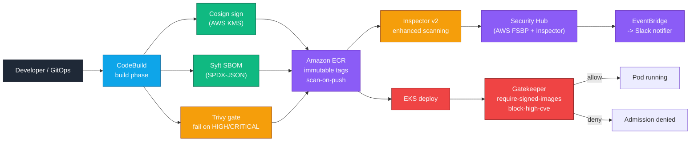

# aws-supply-chain-security

[](https://www.terraform.io/)
[](https://aws.amazon.com/inspector/)
[](https://slsa.dev/spec/v1.0/levels)
[](LICENSE)
[](https://github.com/shivajichaprana/aws-supply-chain-security/actions/workflows/supply-chain-ci.yml)

End-to-end **container supply-chain security** on AWS: image scanning, SBOM
generation, image signing, registry hardening, runtime vulnerability scanning,
and admission-time policy enforcement on Amazon EKS.

The stack achieves [**SLSA Build Level 2**](docs/slsa-level2.md) out of the box
and is wired up to Security Hub so every finding is routed, triaged, and
auditable in one place.

---

## Architecture



The CodeBuild pipeline performs five gates in sequence — `build` → `SBOM` →
`sign` → `scan` → `push` — and Gatekeeper performs two more gates at
admission time (signature + CVE thresholds). Any failure short-circuits the
deploy. See [docs/architecture.md](docs/architecture.md) for the full
flow, including failure paths.

---

## Feature matrix

| Stage              | Mechanism                                                       | Where it lives                                |
|--------------------|-----------------------------------------------------------------|-----------------------------------------------|
| Storage            | Amazon ECR private registries, immutable tags, KMS encryption   | `terraform/ecr.tf`                            |
| Pre-build scanning | Trivy gate in CodeBuild (HIGH / CRITICAL = fail)                | `pipelines/buildspec.yml`                     |
| SBOM               | Syft (SPDX-JSON), pushed as ECR artifact alongside the image    | `pipelines/buildspec.yml`                     |
| Signing            | Cosign with AWS KMS-backed key; AWS Signer profile for SBOM     | `terraform/codebuild.tf`, `terraform/signer.tf` |
| Registry scanning  | Inspector v2 enhanced scanning on every push                    | `terraform/inspector.tf`                      |
| Admission control  | Gatekeeper constraints: signed images + Inspector findings gate | `policies/gatekeeper/*.rego`                  |
| Aggregation        | Security Hub (AWS FSBP standard) + Inspector integration        | `terraform/security-hub.tf`                   |
| Alerting           | EventBridge rule → Lambda → Slack webhook                       | `terraform/findings-forwarder.tf`             |
| Compliance level   | SLSA Build Level 2                                              | [docs/slsa-level2.md](docs/slsa-level2.md)    |

---

## Repository layout

```
terraform/      Terraform stack: ECR, CodeBuild, Signer, Inspector, Security Hub
pipelines/      CodeBuild buildspec for the hardened image build
policies/       Gatekeeper Rego policies and ConstraintTemplates
scripts/        Local helpers: scan-local, generate-sbom, verify-admission
tests/          Rego unit tests + buildspec dry-run + drift checks
docs/           Architecture notes, SLSA L2 mapping, runbook
.github/        Supply-chain CI workflow
Makefile        Wraps the common Terraform + Rego + scan targets
```

---

## Quick start

```bash
# 1. Provision the AWS-side stack (ECR, CodeBuild, Signer, Security Hub).
make init
make plan
make apply

# 2. Install Gatekeeper + the supply-chain policies on your EKS cluster.
kubectl apply -f policies/gatekeeper/constraints.yaml

# 3. Run the policy unit tests locally.
make test-policies

# 4. Dry-run the buildspec without pushing to AWS.
make dryrun
```

See `docs/runbook.md` for incident-response procedures (blocked admission,
Inspector finding triage, key rotation).

---

## Prerequisites

| Tool       | Minimum version | Used for                                            |
|------------|-----------------|-----------------------------------------------------|
| Terraform  | 1.7.0           | Provisioning the AWS-side stack                     |
| AWS CLI    | 2.x             | Authentication, ECR login, KMS                      |
| kubectl    | 1.29            | Applying Gatekeeper constraints on EKS              |
| OPA        | 0.66.0          | Running Rego unit tests locally                     |
| Syft       | 1.10.0          | SBOM generation (also used inside CodeBuild)        |
| Cosign     | 2.4.0           | Image signing (also used inside CodeBuild)          |
| Trivy      | 0.55.2          | Local vulnerability scan                            |
| yq, jq     | latest          | Used by `tests/check-constraints-drift.sh`          |

---

## Security model

This stack is built on three layered guarantees, each independently verifiable:

1. **Provenance** — Every image is built by a single, hardened CodeBuild
   project. CodeBuild stamps the image with git SHA, build timestamp, and
   builder identity. CloudTrail records every signing event.

2. **Integrity** — Every image is signed by a Cosign key held in AWS KMS;
   the private key never leaves KMS. ECR is configured with `IMMUTABLE` tag
   policy so a tag cannot be re-pointed after publication.

3. **Admission control** — Gatekeeper rejects any pod whose image is not
   from an approved ECR registry, not signed, or carries one or more
   CRITICAL Inspector findings. The policies are unit-tested in
   `tests/gatekeeper/` and validated by the CI workflow on every PR.

See [docs/slsa-level2.md](docs/slsa-level2.md) for how each SLSA Build L2
requirement maps to a specific control in this stack.

---

## Contributing

Bug fixes and policy improvements are welcome. Please read
[CONTRIBUTING.md](CONTRIBUTING.md) first — it covers the policy-authoring
workflow, the constraints-drift check, and how to add a new admission rule
end-to-end (policy + constraint + tests + docs).

To report a security issue privately, open a
[GitHub Security Advisory](https://github.com/shivajichaprana/aws-supply-chain-security/security/advisories/new).

---

## License

Released under the [MIT License](LICENSE).
